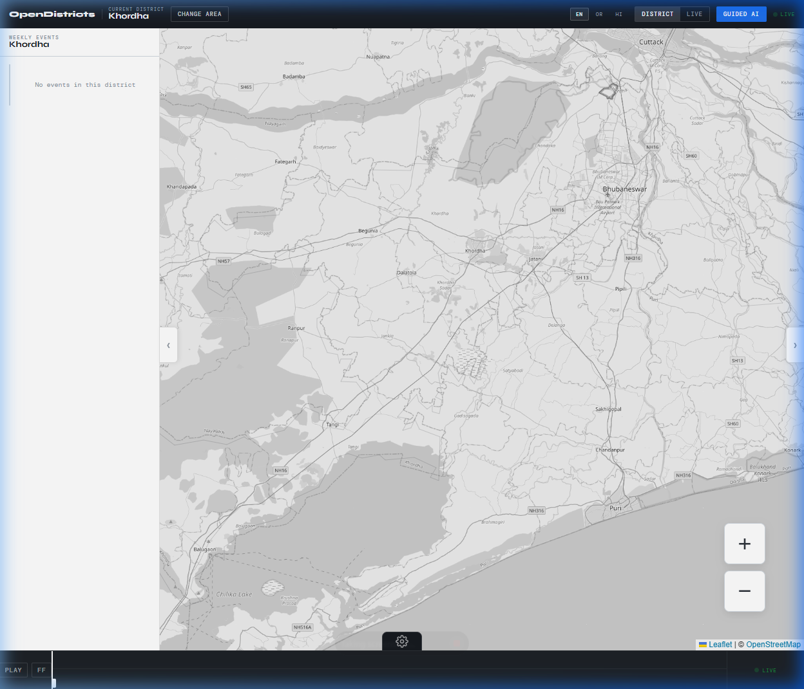
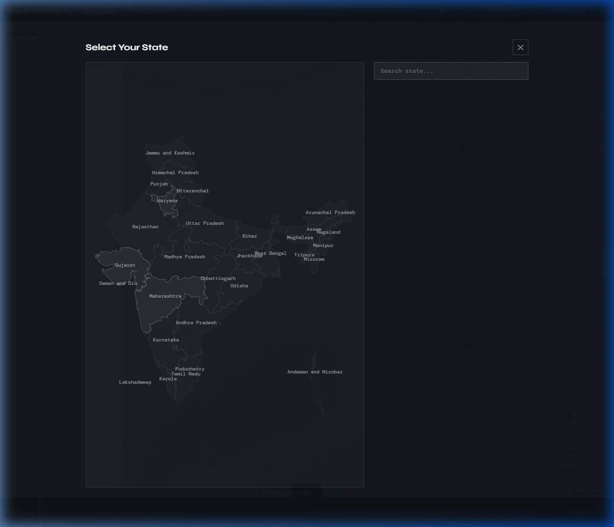
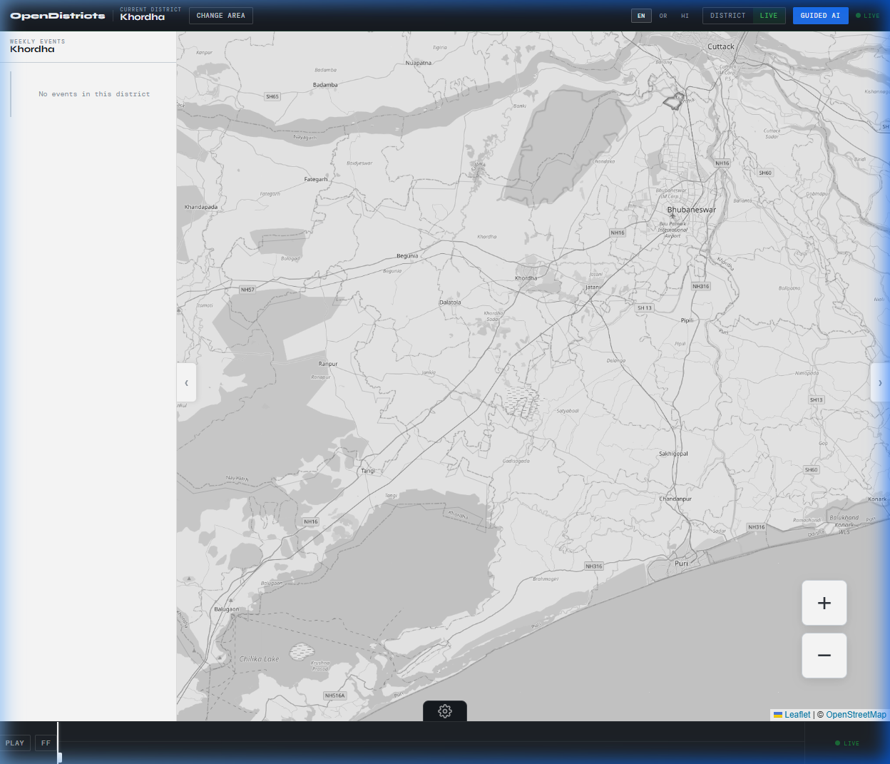
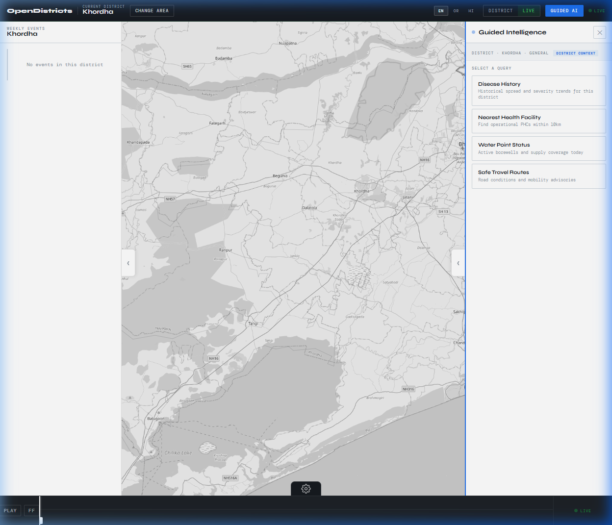
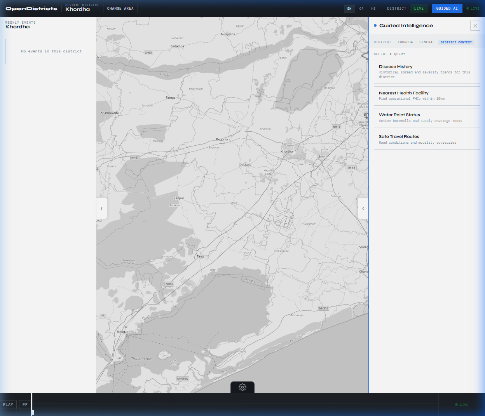

# OpenDistricts

OpenDistricts is a public information system designed to make local and region-level insights accessible to everyone.

The platform combines shared public kiosks with companion mobile and web applications to serve both users with reliable internet access and those without personal devices or connectivity.

OpenDistricts provides location-aware information such as public advisories, healthcare alerts, historical patterns, and essential local context through an intuitive map-based and conversational interface.

The system is designed around a centralized backend, enabling scalable deployment, remote management, and multilingual, low-barrier access across diverse regions.

---

## Key Features

*   **Interactive District Mapping:** Navigate through intuitively designed map interfaces that provide instant geographical context.
*   **Live Mode & Temporal Analysis:** Monitor real-time local updates or use the temporal player to analyze historical trends.
*   **Guided AI Intelligence:** Get instant, AI-driven insights on local health facilities, disease history, and public advisories.
*   **Dynamic Data Visualizations:** Easily understand complex regional data through clear and engaging visual elements.
*   **Multi-Modal Accessibility:** Designed to work seamlessly across shared kiosks, mobile devices, and standard web browsers.

---

## Screenshots & Demo

### Main Map View

*The district-level map providing an overview of regional data and boundaries.*

### Region Selection

*Selecting specific states and districts for targeted intelligence.*

### Live Mode

*Real-time monitoring and active status tracking across districts.*

### AI-Guided Insights

*The Guided Intelligence panel providing actionable insights and contextual data.*

### Detailed Event Reports

*Comprehensive weekly event data and local advisories.*

---

## Project Status

OpenDistricts is an early-stage research and exploration project.  
The repository currently serves as a public record of the concept, system direction, and planned architecture.  
Implementation will be added incrementally as the project evolves.

---

## License

This project is licensed under the Apache License 2.0.

---

## Disclaimer

This repository represents an experimental research and innovation effort.  
It does not provide certified medical, safety, or government advisories.  
All information and system components are illustrative and subject to change.
