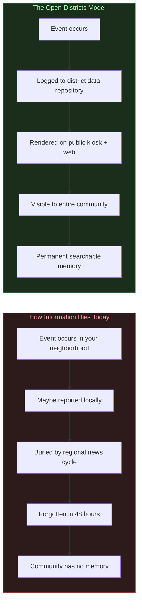
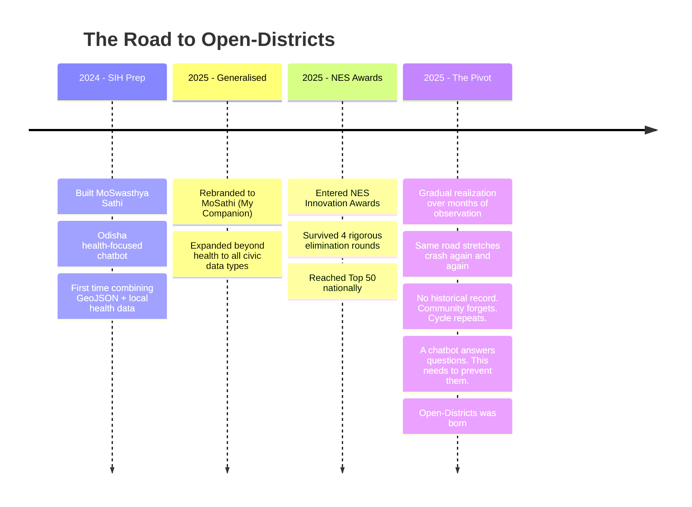
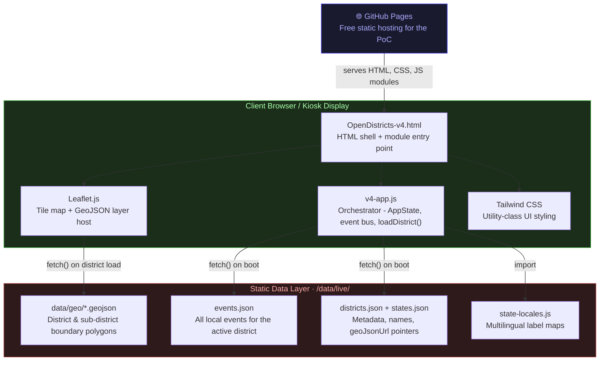

# Open-Districts

### *Fixing the local information blind spot.*

> [!NOTE]
> **[Live Demo](https://opendistricts.github.io/Open-Districts)** \
> *Open it and explore in your browser.* \
> Contains all evolutionary prototypes and latest iteration.

---

## The Problem - The Blind Spot

We live in an age of information abundance, but that abundance is a lie at the local level.

Global stock markets are updated by the millisecond. A celebrity's tweet reaches millions in seconds. But **what happened two streets over, yesterday?** You probably don't know. Your neighbors don't know. And in a week, no one will remember.

This isn't a minor inconvenience. It's a structural failure with real consequences:

- A disease cluster emerges in a ward. Residents have no early warning.
- A road floods seasonally. No one documents the pattern. The municipality forgets. It floods again.
- A local safety incident occurs. Flashy regional headlines bury it within 48 hours. The community moves on, blind.

**We track the world, but we are strangers to our own neighborhoods.**

This is the local information blind spot. **Open-Districts is built to fix it**.

---

## The Philosophy - Why a Kiosk?

When I first approached this problem, the obvious answer was a mobile app. Everyone has a phone, right?

Wrong. The people *most* affected by the local information gap are often the ones *least* served by app-centric solutions:

- Low-income areas where phone batteries die and data is expensive.
- Elderly residents who don't install apps.
- People living the fast-paced life.

So I chose a different anchor: the **public kiosk**.

A kiosk is **always on, always charged, and always public.** It's immune to dead batteries, no-data zones, and the friction of app installation. Mounted in a panchayat office, a railway station, a community center - it becomes **a node of civic memory** that anyone can walk up to and use.

This is a **kiosk-first** design philosophy. The web app you see in this repo is the proof of concept for that kiosk's software layer.

---

## The Journey - Project Evolution

This project didn't start as Open-Districts. It went through several phases of scope expansion, competition pressure, and a gradual shift in thinking.

The NES Innovation Awards acted as a crucible. Four rounds of rigorous judging forced me to defend every design decision, stress-test the concept, and sharpen the vision. I made the Top 50 nationally before stepping back from the final round due to prior commitments.

The pivot wasn't a single dramatic moment. It was a slow accumulation of observations: the same road junction causing accidents every monsoon season because travelers lack historical context and the municipality has no record. News cycles move on, the community forgets, and the same preventable thing happens again the following year. A companion app that *answers questions* wasn't the right abstraction. The right abstraction was a system that ensures the *information is never lost in the first place*.

That's Open-Districts.

---

## Deployment - GitHub Pages (PoC)

This PoC is deployed as a 100% static site on GitHub Pages. That's not an architectural philosophy - it's the most frictionless way to get a prototype in front of anyone, anywhere, with zero setup on their end. There's no server to spin up, no credentials to share, no `npm install` wall to climb before someone can evaluate the idea.

**What this means in practice:**

- **For evaluators:** Click the Live Demo link and the entire system loads in your browser. No accounts, no install.
- **For contributors:** Fork the repo, drop your district's JSON into `/data/live/`, push to your own GitHub Pages URL, and the kiosk renders your data.
- **For production:** GitHub Pages is not the target deployment environment. A real kiosk would run this as a local static bundle served from an embedded device or an intranet server - the client-side architecture stays identical.

---

## Screenshots

### Interactive District Map

*D3.js-powered map rendering with district-level GeoJSON boundaries.*

### State & District Navigator

*Drill down from state to district to sub-district, with live data filtering.*

### Live Mode - Real-Time Status

*Live monitoring view with active event overlays and severity indicators.*

### Guided Intelligence Panel

*The AI-assisted insight panel - designed for the kiosk's conversational interface.*

### Event Detail Reports

*Weekly event logs, local advisories, and historical pattern data.*

---

## Navigating This Repository

The files in this repo tell a story. They are an evolutionary log, not a cleaned-up product release.

| File | What it is |
|---|---|
| `moswasthya-sathi-v1.html` | The original SIH prototype - a health bot for Odisha |
| `moswasthya-sathi-v2.html` | Early UI iteration, map integration begins |
| `moswasthya-sathi-v3.html` | MoSathi generalization, expanded data categories |
| `OpenDistricts-v4.html` | **← Start here.** The current PoC - full map, events, AI panel |
| `data/` | All GeoJSON boundaries and mock event/district data |
| `js/` | App controllers, services, and utility modules |
| `docs/` | Data schema reference, agent prompts, ingestion workflows |
| `scripts/` | Data processing, GeoJSON auditing, and build utilities |

**If you're a first-time visitor:** Open `OpenDistricts-v4.html` in your browser or hit the [Live Demo](https://opendistricts.github.io/Open-Districts/OpenDistricts-v4.html). Everything else is context for contributors.

### Complete User Interaction Flow

This diagram shows the full lifecycle from a first-time visitor opening the app to a community data contributor deploying their own instance.

```mermaid
flowchart TD
    subgraph VISITOR["👤 First-Time Visitor (Citizen / Researcher)"]
        V1["Opens Live Demo URL"] --> V2["App boots, loads default district\n(Khordha, Odisha)"]
        V2 --> V3["Sees interactive map\nwith event overlays"]
        V3 --> V4{"User action?"}
        V4 -->|"Clicks 'Change Area'"| V5["HierarchyCtrl opens\nIndia SVG map selector"]
        V5 --> V6["Selects state → drills to district list"]
        V6 --> V7["Clicks district → loadDistrict() fires\nMap + sidebar refresh for new district"]
        V4 -->|"Clicks map marker"| V8["Event focused:\nMap highlights polygon\nSidebar scrolls to event card"]
        V4 -->|"Drags time scrubber"| V9["Historical mode activated\nMap shows snapshot of events\nat that point in time"]
        V4 -->|"Opens AI panel"| V10["AICtrl panel opens\n⚠️ Intelligence integration\npending - contribution opportunity"]
    end

    subgraph CONTRIBUTOR_DEV["🧑‍💻 Developer Contributor"]
        D1["Forks repository"] --> D2["Reads docs/DATA_SCHEMA_REFERENCE.md"]
        D2 --> D3["Creates data/live/ files:\nevents.json · districts.json\nstates.json · regions.json"]
        D3 --> D4["Adds district GeoJSON\nto data/geo/{STATE}.geojson"]
        D4 --> D5["Enables GitHub Pages\non their fork"]
        D5 --> D6["District kiosk live\nat their GitHub Pages URL"]
    end

    subgraph CONTRIBUTOR_DATA["📋 Data Contributor (No code required)"]
        N1["Identifies local events\n(incidents, health, infrastructure)"]
        N1 --> N2["Formats to event schema:\nid, category, title, timestamp,\ngeoPoint, impactScale, source"]
        N2 --> N3["Opens Pull Request\nwith events.json additions"]
        N3 --> N4["Merged → immediately\nvisible in the live dataset"]
    end

    style VISITOR fill:#1a2e2e,stroke:#44bbbb,color:#aaffff
    style CONTRIBUTOR_DEV fill:#1a1a2e,stroke:#4444bb,color:#bbbbff
    style CONTRIBUTOR_DATA fill:#2e2a1a,stroke:#bbaa44,color:#ffeebb
```

---

## Global Call for Contribution

This is not an India-only problem. Every city, every district, every neighborhood on Earth has this blind spot.

This repository is an open invitation.

### For Developers

The V4 PoC proves the visual and data layers work. What's **missing** is the intelligence layer:

- **AI Companion Integration:** Build the conversational panel that answers "What happened in my area this week?" using local event data as context.
- **Offline-First PWA:** Wrap the kiosk UI in a Progressive Web App with service workers for true offline resilience.
- **Real Data Ingestion:** Build scraper pipelines that pull from local government portals, civic APIs, or Nominatim/OSM and conform to the event schema.
- **Multilingual NLP:** The `data/state-locales.js` scaffolding is there. Build the translation pipeline to make it truly local.
- **Notification Layer:** Alert community members via SMS/WhatsApp when a high-severity event is logged in their district.

### For Data Contributors

You don't need to write a single line of code to contribute. If you know your city, your district, your neighborhood - **you are a contributor.**

1. **Fork this repository.**
2. Create a folder under `data/` for your city: `data/your-city/`
3. Add `events.json`, `districts.json`, and a GeoJSON boundary file following the schema in [docs/DATA_SCHEMA_REFERENCE.md](docs/DATA_SCHEMA_REFERENCE.md).
4. Open a Pull Request. Describe your region and data sources.

**Your city deserves a memory. Help build it.**

---

## Future Roadmap

This PoC proves the concept is viable and the data model is sound. The next phase is deeper.

| Phase | Focus |
|---|---|
| **Research** | Rigorous system design for multi-region, multi-tenant kiosk deployment at scale |
| **Architecture** | Secure AI integration - local inference or privacy-preserving API calls - so the intelligence panel works without leaking community data |
| **Infrastructure** | Explore IPFS / P2P data replication to make the memory truly decentralized |
| **Pilot** | Deploy a real kiosk in a real panchayat or community center and measure actual utility |

The long-term vision is a world where every district, town, and ward has its own persistent, searchable, community-owned information layer - not controlled by a platform, not dependent on a vendor, not silenced by an algorithm.

Open-Districts is the first step.

---

## License

This project is licensed under the **Apache License 2.0**. See [LICENSE](LICENSE) for details.

---

## Disclaimer

This repository is an experimental research and prototype effort by [Anshuman Singh](https://github.com/DataBoySu).
It does not provide certified medical, safety, legal, or government advisories.
All event data in the repository is mock/illustrative data for demonstration purposes only.
